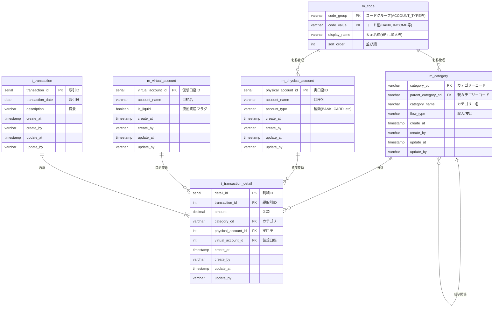

# データベース設計書

## 1. 概要
本ドキュメントは、家計管理アプリ「Flowlet」のデータベース設計を定義したものです。
「実口座と仮想口座の二重管理構造」および「複合内訳（スプリット）管理」を実現するための構造を採用しています。

## 2. ER図

## 3. テーブル定義

### 3.1. m_code (汎用コードマスタ)
システム内の各種区分値（Type）の表示名や並び順を管理します。

| カラム名 | 型 | 制約 | 説明 |
| :--- | :--- | :--- | :--- |
| `code_group` | VARCHAR(30) | PK | グループ（例: `FLOW_TYPE`, `ACCOUNT_TYPE`） |
| `code_value` | VARCHAR(30) | PK | コード値（例: `INCOME`, `BANK`） |
| `display_name` | VARCHAR(50) | NOT NULL | 画面表示用の名称（例: `収入`, `銀行`） |
| `sort_order` | INT | NOT NULL | 画面上の表示順 |

### 3.2. m_category (カテゴリーマスタ)
| カラム名 | 型 | 制約 | 説明 |
| :--- | :--- | :--- | :--- |
| `category_cd` | VARCHAR(20) | PK | カテゴリーコード |
| `parent_category_cd` | VARCHAR(20) | FK | 親カテゴリーコード（最上位の場合はNULL） |
| `category_name` | VARCHAR(50) | NOT NULL | カテゴリー名 |
| `flow_type` | VARCHAR(10) | NOT NULL | 収入 (INCOME) / 支出 (OUTGO) |

### 3.3. m_physical_account (実口座マスタ)
| カラム名 | 型 | 制約 | 説明 |
| :--- | :--- | :--- | :--- |
| `physical_account_id` | SERIAL | PK | 実口座ID |
| `account_name` | VARCHAR(50) | NOT NULL | 口座名（例：〇〇銀行、現金） |
| `account_type` | VARCHAR(20) | NOT NULL | 種類（BANK, CARD, CASH, etc） |

### 3.4. m_virtual_account (仮想口座マスタ)
| カラム名 | 型 | 制約 | 説明 |
| :--- | :--- | :--- | :--- |
| `virtual_account_id` | SERIAL | PK | 仮想口座ID |
| `account_name` | VARCHAR(50) | NOT NULL | 目的名（例：旅行用、予備費、自由費） |
| `is_liquid` | BOOLEAN | NOT NULL | 流動資産フラグ（TRUE: 「あといくら使えるか」の計算対象） |

### 3.5. t_transaction (取引)
| カラム名 | 型 | 制約 | 説明 |
| :--- | :--- | :--- | :--- |
| `transaction_id` | SERIAL | PK | 取引ID |
| `transaction_date` | DATE | NOT NULL | 取引日 |
| `description` | VARCHAR(200) | | 取引全体の説明・メモ |

### 3.6. t_transaction_detail (取引明細)
| カラム名 | 型 | 制約 | 説明 |
| :--- | :--- | :--- | :--- |
| `detail_id` | SERIAL | PK | 明細ID |
| `transaction_id` | INT | FK, NOT NULL | 親取引IDへの参照 |
| `amount` | DECIMAL(15,2) | NOT NULL | 金額 |
| `category_cd` | VARCHAR(20) | FK, NOT NULL | カテゴリーコードへの参照 |
| `physical_account_id` | INT | FK, NOT NULL | 変動した実口座IDへの参照 |
| `virtual_account_id` | INT | FK, NOT NULL | 割り当てられた仮想口座IDへの参照 |

## 4. 特記事項
- **二重管理の同期**: `t_transaction_detail` にて実口座と仮想口座を同時に記録することで、常に `Σ実口座残高 = Σ仮想口座残高` を保証する。
- **スプリット管理**: 1つの `t_transaction` に対して複数の `t_transaction_detail` を作成可能。
- **共通カラム**: すべてのテーブルは `create_at`, `create_by`, `update_at`, `update_by` を保持する（`.junie/db_guidelines.md` 参照）。
